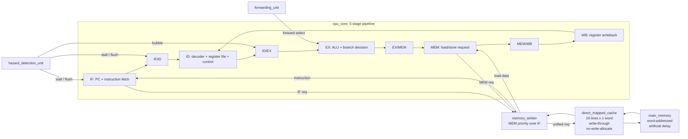

# Architecture

## Locked Top-Level System

```text
cpu_core -> memory_arbiter -> direct_mapped_cache -> main_memory
```

## CPU/Cache Block Diagram



The project implements a 16-bit, word-addressed, 5-stage pipelined CPU with a
Von Neumann memory path. Instruction fetch and data memory access are separate
logical CPU requests, but both are arbitrated onto one unified direct-mapped
cache.

## Pipeline Stages

| Stage | Role |
|---|---|
| IF | Holds PC and requests instruction word from unified cache path |
| ID | Decodes instruction, reads register file, generates immediates/control |
| EX | Executes ALU operation, computes branch decision and target |
| MEM | Issues LW/SW requests through memory arbiter |
| WB | Writes ALU result or load data back to register file |

Pipeline registers:

```text
IF/ID -> ID/EX -> EX/MEM -> MEM/WB
```

Each pipeline register must support:

- `stall`
- `flush`
- `valid`

## Unified Memory Structural Hazard

Because the architecture is Von Neumann, IF and MEM share the same cache.

Arbiter rule:

```text
MEM request has priority over IF request.
```

When the MEM stage uses the cache, instruction fetch must stall.

## Control Rules

| Condition | Action |
|---|---|
| Cache miss | Global stall until cache `ready` |
| Load-use hazard | Freeze PC and IF/ID, flush ID/EX bubble |
| Branch/jump taken | Flush IF/ID and ID/EX, update PC target |
| Write to R0 | Ignore |

## Non-Goals

The locked architecture explicitly excludes:

- superscalar execution
- out-of-order execution
- branch prediction
- multi-level cache
- write-back cache
- non-blocking cache
- multiple outstanding memory requests
