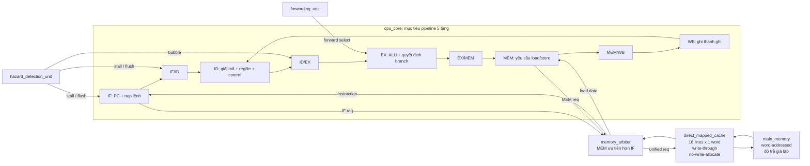

# Kiến trúc

## Tổng quan hệ thống (Locked Top-Level)

```text
cpu_core -> memory_arbiter -> direct_mapped_cache -> main_memory
```

## Trạng thái hiện tại

- Dự án đã hoàn thiện kiến trúc **Pipeline 5 tầng** (IF, ID, EX, MEM, WB) với việc xử lý tuần tự qua các stage và đã vượt qua các bài kiểm thử tổng hợp (100% PASS).
- Các module hỗ trợ pipeline (`pipeline_regs`, `forwarding_unit`, `hazard_detection_unit`) đã được tích hợp đầy đủ để xử lý Data Hazard, Load-Use Hazard và Control Hazard (branch/jump).
- `direct_mapped_cache` đã hoàn thiện FSM trạng thái xử lý Cache Hit/Miss, tích hợp thành công với `memory_arbiter` và `main_memory` (mô phỏng delay).

## Sơ đồ khối CPU/Cache



Dự án hướng tới CPU 16-bit (word-addressed) kiến trúc Von Neumann với đường bộ nhớ thống nhất. CPU có 2 “cổng logic” tách riêng: nạp lệnh (IF) và truy cập dữ liệu (MEM), sau đó được `memory_arbiter` hợp nhất xuống 1 cổng cache vật lý.

## Các tầng pipeline

| Tầng | Vai trò |
|---|---|
| IF | Giữ PC và gửi yêu cầu nạp 1 word lệnh qua đường cache thống nhất |
| ID | Giải mã lệnh, đọc regfile, tạo immediate và tín hiệu điều khiển |
| EX | Thực thi ALU, quyết định branch và tính địa chỉ đích |
| MEM | Phát yêu cầu LW/SW qua `memory_arbiter` |
| WB | Ghi kết quả ALU hoặc dữ liệu load về regfile |

Pipeline registers:

```text
IF/ID -> ID/EX -> EX/MEM -> MEM/WB
```

Mỗi pipeline register cần hỗ trợ:

- `stall`
- `flush`
- `valid`

## Xung đột cấu trúc bộ nhớ thống nhất

Vì Von Neumann, IF và MEM dùng chung cache.

Quy tắc arbiter:

```text
MEM request có ưu tiên cao hơn IF request.
```

Khi MEM đang dùng cache, IF phải stall.

## Quy tắc điều khiển

| Điều kiện | Hành động |
|---|---|
| Cache miss | Stall toàn cục đến khi cache `ready` |
| Load-use hazard | Giữ PC và IF/ID, flush ID/EX tạo bubble |
| Branch/jump taken | Flush IF/ID và ID/EX, cập nhật PC tới target |
| Ghi vào R0 | Bỏ qua |

## Ngoài phạm vi (Non-Goals)

Kiến trúc “locked” không bao gồm:

- superscalar
- out-of-order
- branch prediction
- multi-level cache
- write-back cache
- non-blocking cache
- nhiều yêu cầu bộ nhớ outstanding
